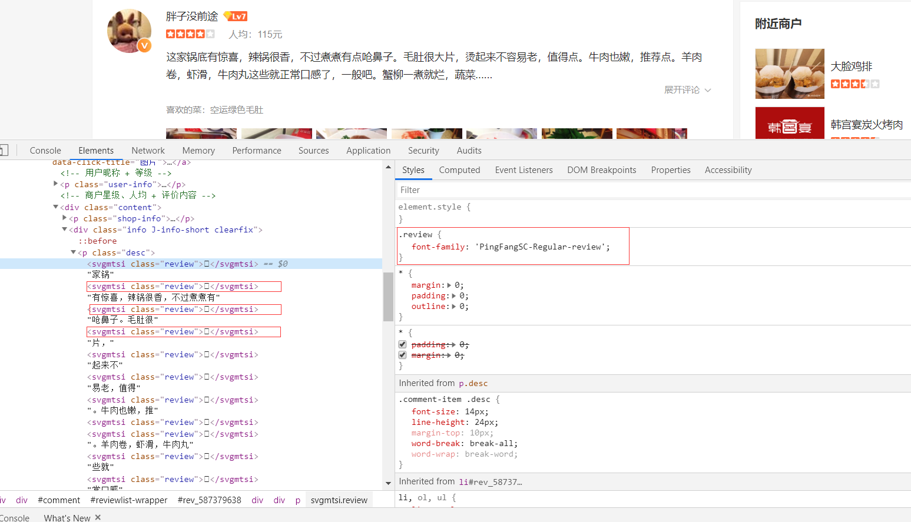
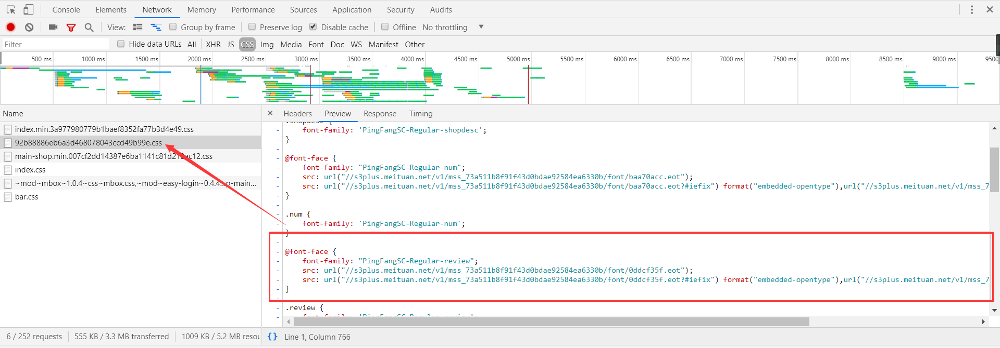
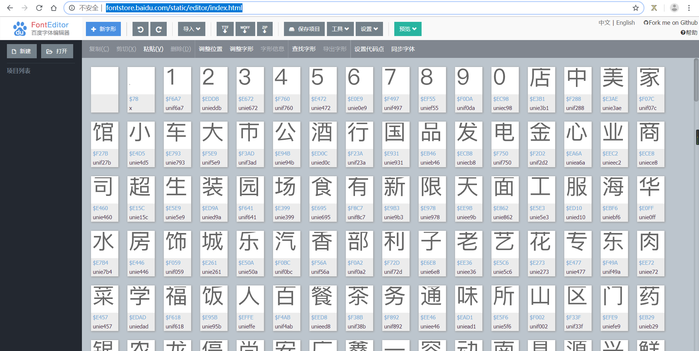
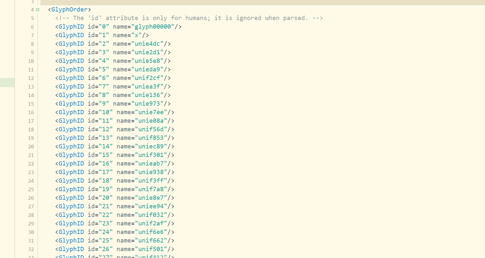
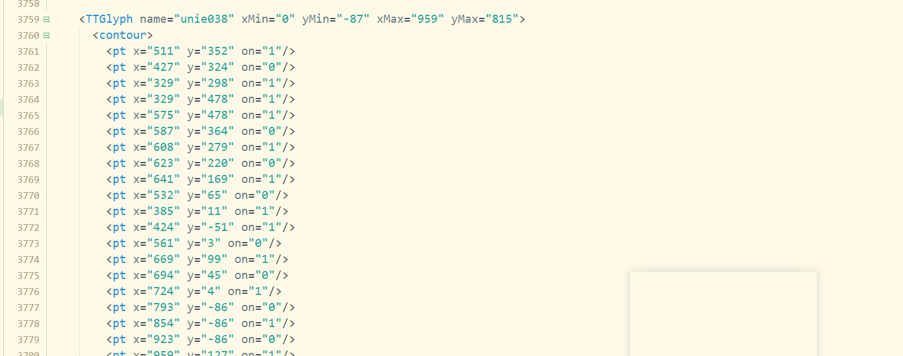
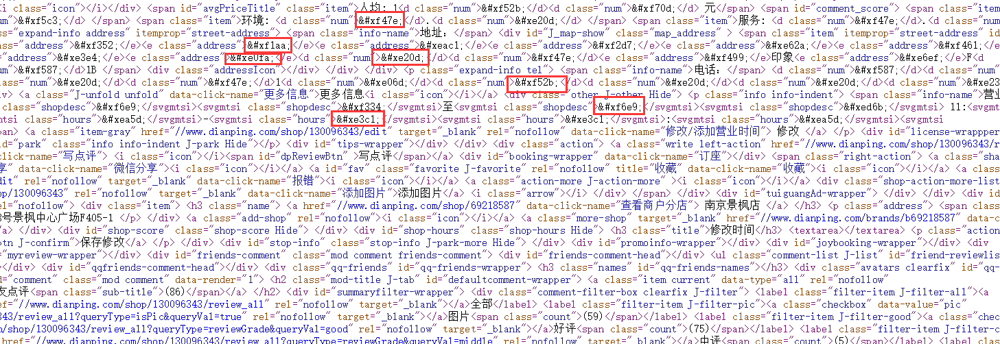
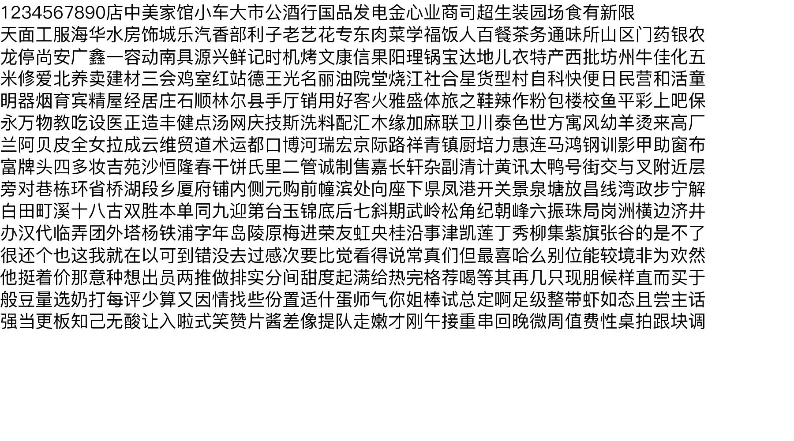
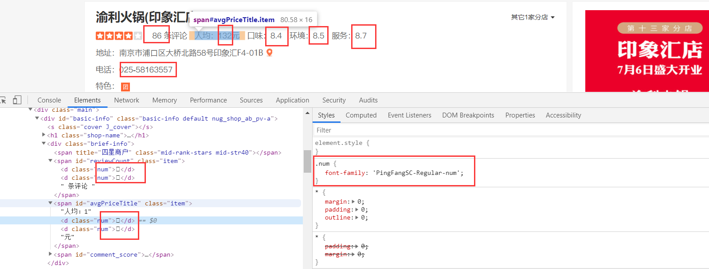

# 针对大众点评网上商铺评论字体替换反爬的反反爬
#### 字体替换的反爬，在之前网站出现过，如淘宝、猫眼等。但是主要针对于数字字体替换，由于数字就十个，完全可以手动分析字体文件，找出编码与数字的关系。**但是**，大众点评评论中的字体文件中的文字共603个，手动写对应关系是不可能的事。
### 下面将介绍一种可行的方案：
这是进入商铺页面 http://www.dianping.com/shop/130096343

我们可以看到页面源代码中有许多的```svgmtsi```标签，但是文字都无法正常显示，点击标签可以看到右边的css属性
```css
.review {
    font-family: 'PingFangSC-Regular-review';
}
```
我们看到```svgmtsi```这样的标签都是使用的自定义字体，字体定义一般都是在css文件中定义，我们需要找到css文件。

字体定义都是以```@font-face```形式定义，在上图红框中就是```PingFangSC-Regular-review```字体的定义。我们可以看到有3个url链接，chrome浏览器支持的是```.woff```字体
```css
@font-face {
    font-family: "PingFangSC-Regular-review";
    src: url("//s3plus.meituan.net/v1/mss_73a511b8f91f43d0bdae92584ea6330b/font/0ddcf35f.eot");
    src: url("//s3plus.meituan.net/v1/mss_73a511b8f91f43d0bdae92584ea6330b/font/0ddcf35f.eot?#iefix") format("embedded-opentype"),url("//s3plus.meituan.net/v1/mss_73a511b8f91f43d0bdae92584ea6330b/font/0ddcf35f.woff");
}
```
根据这个链接就可以下载字体文件。在代码中链接前面记得加上```http:```。
下面就是以上内容的代码：(函数返回的是字体路径，在后面解析字体会用到这个路径)
```python
def downloadFontFile(): #向解析页面获得css的href，发送请求，对css正则匹配出字体的url，下载字体文件
    cssUrl = "http://s3plus.meituan.net/v1/mss_0a06a471f9514fc79c981b5466f56b91/svgtextcss/92b88886eb6a3d468078043ccd49b99e.css"
    css_response = seedRequest(cssUrl)
    fontUrl = re.findall('@font-face{font-family: "PingFangSC-Regular-review";src.*?format.*?url\("(.*?)"\);}',css_response.text,re.S)[0]
    print(fontUrl)
    font_response = seedRequest("http:"+fontUrl)
    fontPath = os.path.join(os.getcwd(),os.path.basename(fontUrl))
    with open(fontPath,"wb") as fp:
        fp.write(font_response.content)
    return fontPath
```
在下载完字体后，可以上网页预览下字体文件,网页链接 http://fontstore.baidu.com/static/editor/index.html

我们可以用python中```fonttools```库解析字体。向将字体文件转换成xml格式文件，方便我们手动打开查看。
```python
from fontTools.ttLib import TTFont
font = TTFont('./20036245.woff')    # 打开文件
font.saveXML('./font.xml')     # 转换成 xml 文件并保存
```
打开xml格式文件，部分截图如下

这是字形定义的部分

通过对xml文件分析，并没有找到字体编码可能存在的潜在关系。所以只能将字体文件中所定义的所有汉字显示在图片上，再通过```pytesseract```库对图片进行文字识别，就可以找到编码与汉字所对应的关系。
```python
def fontConvert(fontPath):     #将web下载的字体文件解析，返回其编码和汉字的对应关系
    font = TTFont(fontPath)  # 打开文件
    codeList = font.getGlyphOrder()[2:]
    im = Image.new("RGB", (1800, 1000), (255, 255, 255))
    dr = ImageDraw.Draw(im)
    font = ImageFont.truetype(fontPath, 40)
    count = 15
    arrayList = numpy.array_split(codeList,count)   #将列表切分成15份，以便于在图片上分行显示
    for t in range(count):
        newList = [i.replace("uni", "\\u") for i in arrayList[t]]
        text = "".join(newList)
        text = text.encode('utf-8').decode('unicode_escape')
        dr.text((0, 50 * t), text, font=font, fill="#000000")
    # im.save("sss.jpg")
    #  = Image.open("sss.jpg")      #可以将图片保存到本地，以便于手动打开图片查看
    result = pytesseract.image_to_string(im, lang="chi_sim")
    result = result.replace(" ","").replace("\n","") #OCR识别出来的字符串有空格换行符
    codeList = [i.replace("uni","&#x")+";" for i in codeList]
    return dict(zip(codeList,list(result)))
```
注意：查看网站源码中的汉字编码```&#xf587;```和xml字体文件中的编码```unie038```有些不同,网页源码截图如下：

将文字加载到图片上的图片如下，仅供参考（由于字体文件一直在更换，下面图片是之前生成的，跟github中提供的字体文件不对应的）。

这样就可以获得网页字体编码与汉字的对应的关系了。在爬取网站时，获得网页源码后，可将这些编码替换掉。
##### 最后附上完整代码：
```python
# coding=utf-8
import requests
import re
import os

from fontTools.ttLib import TTFont  # 解析字体文件的包
from PIL import Image, ImageDraw, ImageFont  #绘制图片
import pytesseract   #文字识别库,这个包的安装还需要安装tesseract.exe，可以网上搜教程
import numpy

header = {
    "User-Agent":"Mozilla/5.0 (Windows NT 10.0; Win64; x64) AppleWebKit/537.36 (KHTML, like Gecko) Chrome/75.0.3770.100 Safari/537.36",
    "Connection": "keep-alive",
    "Upgrade-Insecure-Requests": "1",
    "Cookie": "_lx_utm=utm_source%3DBaidu%26utm_medium%3Dorganic; _lxsdk_cuid=16c47c01fafc8-07aac54d06158d-e343166-144000-16c47c01fafc8; _lxsdk=16c47c01fafc8-07aac54d06158d-e343166-144000-16c47c01fafc8; _hc.v=825e3bfc-d05a-6e37-660c-0cba50dc559e.1564571869; s_ViewType=10; cy=16; cityid=16; cye=wuhan; cy=5; cye=nanjing; _lxsdk_s=16c52116a9d-0a5-da0-bb3%7C%7C25"
}
def seedRequest(url):
    response = requests.get(url ,headers=header)
    response.encoding = "utf-8"
    print(response.status_code)
    return response

def downloadFontFile(): #向解析页面获得css的href，发送请求，对css正则匹配出字体的url，下载字体文件
    cssUrl = "http://s3plus.meituan.net/v1/mss_0a06a471f9514fc79c981b5466f56b91/svgtextcss/92b88886eb6a3d468078043ccd49b99e.css"
    css_response = seedRequest(cssUrl)
    fontUrl = re.findall('@font-face{font-family: "PingFangSC-Regular-review";src.*?format.*?url\("(.*?)"\);}',css_response.text,re.S)[0]
    print(fontUrl)
    font_response = seedRequest("http:"+fontUrl)
    fontPath = os.path.join(os.getcwd(),os.path.basename(fontUrl))
    with open(fontPath,"wb") as fp:
        fp.write(font_response.content)
    return fontPath

def fontConvert(fontPath):     #将web下载的字体文件解析，返回其编码和汉字的对应关系
    font = TTFont(fontPath)  # 打开文件
    codeList = font.getGlyphOrder()[2:]
    im = Image.new("RGB", (1800, 1000), (255, 255, 255))
    dr = ImageDraw.Draw(im)
    font = ImageFont.truetype(fontPath, 40)
    count = 15
    arrayList = numpy.array_split(codeList,count)   #将列表切分成15份，以便于在图片上分行显示
    for t in range(count):
        newList = [i.replace("uni", "\\u") for i in arrayList[t]]
        text = "".join(newList)
        text = text.encode('utf-8').decode('unicode_escape')
        dr.text((0, 50 * t), text, font=font, fill="#000000")
    # im.save("sss.jpg")
    #  = Image.open("sss.jpg")      #可以将图片保存到本地，以便于手动打开图片查看
    result = pytesseract.image_to_string(im, lang="chi_sim")
    result = result.replace(" ","").replace("\n","")
    codeList = [i.replace("uni","&#x")+";" for i in codeList]
    return dict(zip(codeList,list(result)))

if __name__ == "__main__":
    fontDict = fontConvert(downloadFontFile())
    print(fontDict)
```

**附加**：该大众网页页面上还有其他的字体替换的反爬，如：

这种数字替换的完全可以手动书写对应关系。当然也可以用以上介绍的方法。所介绍的方法中tesseract_OCR识别有些耗时。

#### 以上为个人实践研究所写，如有错误，请多多指正！！！
#### 联系我：  768348710@qq.com